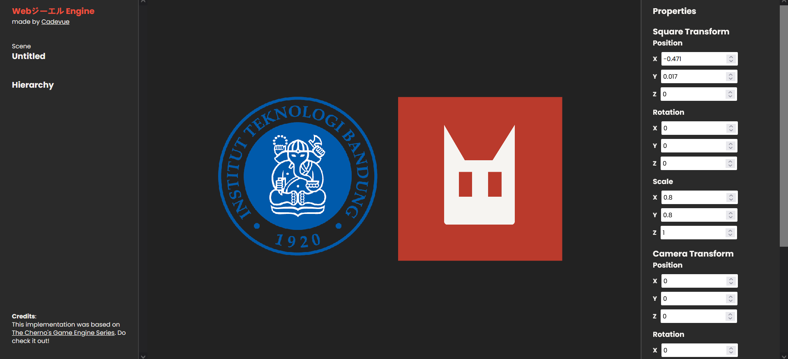

# Game Engine on Web ⚙🔥 (In development)
An attempt to create Game Engine in Web. Adapted from [The Cherno's Game Engine Series](https://www.youtube.com/watch?v=JxIZbV_XjAs&list=PLlrATfBNZ98dC-V-N3m0Go4deliWHPFwT). Built with Vite + Svelte + Typescript! Currently support WebGL, might add WebGPU support in the future as well!

## Run Instruction 🏃‍♂️
1. Clone the repository (use the `git clone`)
2. Enter the cloned project directory
3. Install the dependencies
      ```batch
      > npm install
      ```
4. Run locally at http://localhost:5173
      ```batch
      > npm run dev
      ```

## Milestones 🏆
1. 2D Renderer (On progress ⭐)
      - [x] Basic Renderer
      - [x] Texture Support
      - [x] Camera
      - [x] Input Handling
      - [x] Editor
      - [ ] Sprites
      - [ ] Animation
      - [ ] UI Elements
      - [ ] Scene Management
      - [ ] Physics
      - [ ] Audio
      - [ ] Scripting
      - [ ] Networking

**Screenshot (3 February 2025):**



2. 3D Renderer (Coming soon 🚀)
